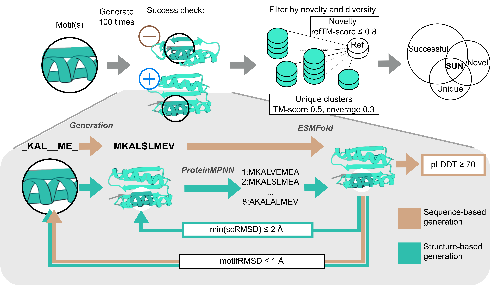
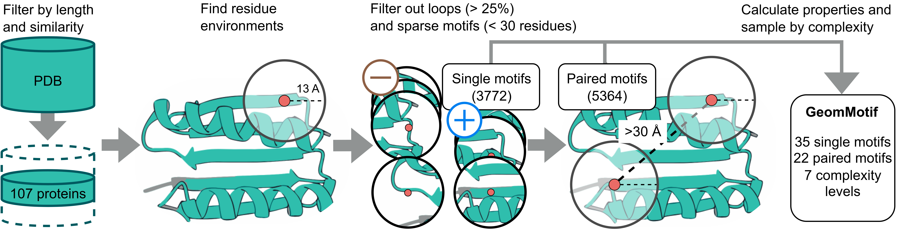

# GeomMotif

We introduce GeomMotif, a systematic benchmark that evaluates arbitrary structural fragment preservation without requiring functional specificity. We sample 57 tasks from the PDB, each containing one or two motifs with up to 7 continuous fragments. The tasks are characterized by structural and physicochemical properties: size, geometric context, secondary structure, hydrophobicity, charge, and degree of burial. We evaluate models using scRMSD and pLDDT for geometric fidelity and clustering for structural diversity and novelty. 

## Models validation


### Installation:
create conda env:
```
conda env create --file environment.yaml
```

upload ProteinMPNN:
```
cd evaluation/mpnn
git clone https://github.com/dauparas/ProteinMPNN.git
```


### Usage
Example input files are in `evaluation/example` folder. \
Scripts for validation are: \
* for sequence models: \
`evaluation/run_eval_seq.sh`
* for structure models: \
`evaluation/run_eval_struct.sh`

### Metrics
1. Sequence models
   - Quality check: plddt (`evaluation/folding/structure_from_sequence.py`)
   - Geometry check: RSMD (`evaluation/metrics_calculation.py`)
2. Structure models
   - Quality check: scRMSD (`evaluation/mpnn/run_mpnn.sh` + `evaluation/metrics_calculation.py`)
   - Geometry check: RSMD ( `evaluation/metrics_calculation.py`)

## Benchmark data construction
```
cd construction
./run_construction.sh
```

